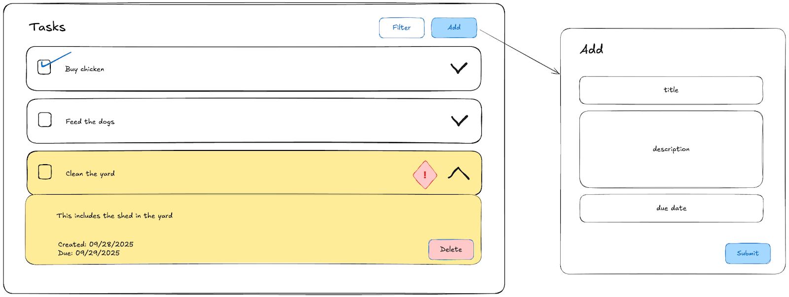
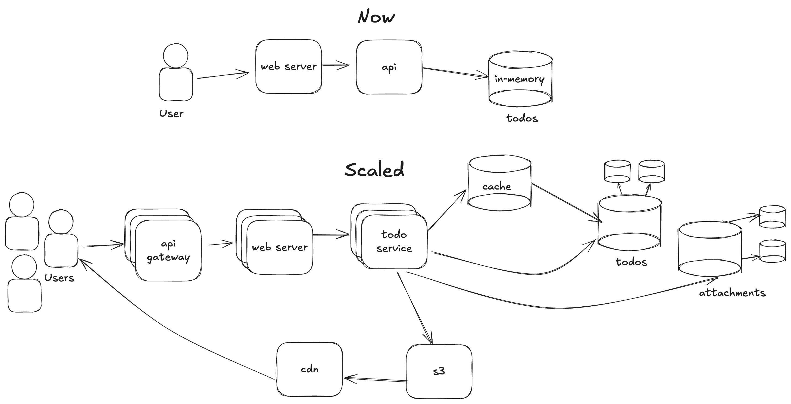

# To Do Task Management App

## Requirements

### Assumptions
- The application will be used on desktop computers, accessible from the internet.
- Users will only see their own tasks.
- Users will manage daily tasks — the number of tasks is expected to be in the dozens rather than thousands or millions.

### Functional Requirements

#### Task Management
- Create To Dos (title, optional description)
- Complete, un-do complete, and delete To Dos
- Assign due dates to To Dos

#### To Do Views
- Sort by due date and status
- Quickly see overdue To Dos or pending To Dos
- Filter by status (complete/active) or overdue To Dos

#### Below the Fold Features
- Accounts
- Authentication (multi-factor or otherwise)
- Recurring tasks
- Attaching images or files
- Notifications
- Integrations with calendars or inboxes
- Categories or folders

### Non-Functional Requirements
- Performant — quick loading and low request latency
- Prioritize consistency over availability

---

## UX

## Best Practices

### API
- Thin controllers that manage only requests and responses.
- Service methods encapsulate business logic.
- RESTful naming conventions (plural nouns, proper status codes)
- EF models are separate from DTOs.
- Dependency injection for low coupling, high flexibility, and easier testing.
- Asynchronous calls to avoid blocking.

### UI
- Modular structure: organize components, modules, and hooks.
- Local state management (avoid over-engineering with external libraries).
- Avoid prop drilling using contexts.
- APIs called from hooks to isolate data fetching.
- Memoization for performance.
- Use `react-hook-form` for form validation and submission.
- Build components using Material UI.

---

## How to Scale and Become Production-Ready

### Architecture

#### Database
- Move over from EF In-Memory Persistence to a real database.  Since none of the Todo operations are strictly transactional and the singular model is not relational, there's not a strong requirement to use SQL, however we stated in our assumptions that we favor consistency over eventual consistency.  While NoSQL is better for scale and schema flexibility, we're not assuming millions of daily average users.  SQL is a fine choice for this application, especially as SQL Server is native to the .NET Framework.
- Indices for performance - these should be created based on access patterns.  We don't have a requirement to search for tasks so we don't have any complicated queries.  In fact, our filtering is executed on the front-end.  To scale and handle a larger number of tasks, we may choose to sort or filter on title, status, description, or dates; these would be indicative of our indices.
- We could use a master-slave strategy to ensure redundancy and read performance.

#### Caching
- Use Redis or in-memory caching for frequent queries.
- Implement TTL and cache invalidation strategy (LRU).
- Use local storage for offline mode.

#### Media
- Use S3 for file and photo attachments.
- Utilize a CDN for media delivery.
- Track metadata in the database.

#### API Gateway
- Introduce an API Gateway to handle load balancing and rate limiting

#### Multiple instances
- We can introduce multiple instances of these components, especially the application server, to handle the enhanced scale load.

### Security
- Rate limiting
- Authentication
- Use HTTPS
- API versioning (e.g., `/api/v1/todos`)

### Documentation
- Swagger for endpoints
- Comprehensive README files

### Deployments
- CI/CD process (build, test, deployment automation)
- Staging and production environments
- Containerized deployment for scalability

### Monitoring, Observability, and Analytics
- Logging improvements
- Sentry for alerts
- NewRelic/Grafana for monitoring

### Testing
- Unit tests for front-end and back-end
- Integration tests for API contracts
- End-to-end tests for features
- QA procedures

### Look and Feel
- Theming and styling to avoid CSS pollution
- Routing and multiple pages
- Accessibility
- Storybook for design system library

### Improved Features
- Implement below-the-fold features

---

## Setup

### `todo-api`
https://github.com/nicolequindara/todo-api
1. Install the .NET SDK & Runtime (`brew install dotnet`)
2. Build the app with `dotnet build`
3. Run the app with `dotnet run`

### `todo-interface`
https://github.com/nicolequindara/todo-interface
1. Install dependencies with `npm ci`
2. Build the app with `npm run build`
3. Run the app with `npm run start`
4. The terminal will confirm that the UI is running on http://localhost:3000/

## Demo
1. The application displays each todo as an accordion.
2. Click on the chevron to the right of each todo to expand the accordion.  This will display a description (if one exists) as well as other metadata like the creation date and due date (if one was set).
3. Click the Delete button inside the todo's accordion to delete a todo.
4. Click the Add button to add a new todo.  The form will validate the inputs prior to submission.
